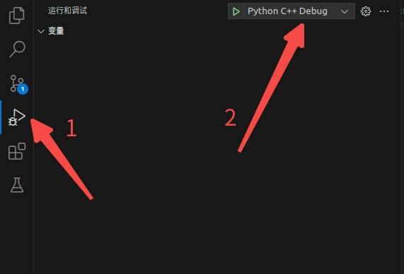
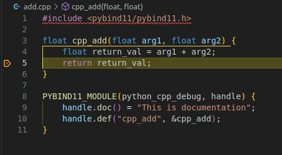
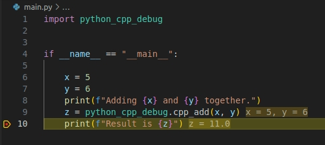

# pybind-debug

VSCode extension installation: Python C++ Debugger

# How to run
1. sh build.sh (If you use conda environment, change the variable **CONDA_NAME** and run sh build-conda.sh)
2. Open vscode, click and run it.

3. Press **y**, and Enter password
4. Done!

# Error
It is recommended to use Python 3.8. 
After testing, the installed pybind version is out of date when python version is 3.12.

# Ref
[1]https://stackoverflow.com/questions/71125094/debug-a-python-c-c-pybind11-extension-in-vscode-linux  
[2]https://marketplace.visualstudio.com/items?itemName=benjamin-simmonds.pythoncpp-debug&ssr=false#overview